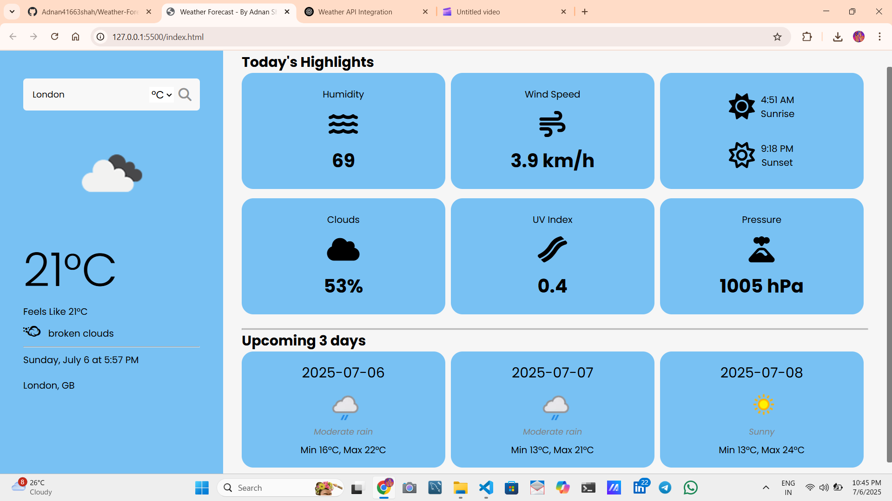
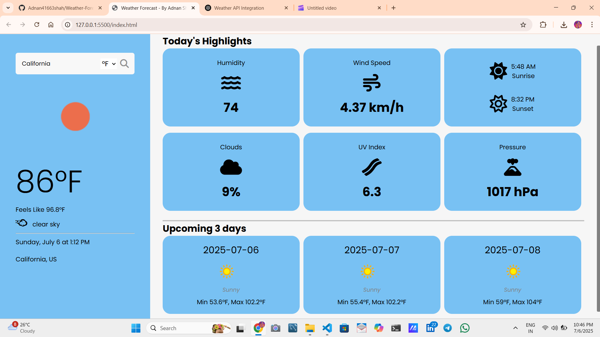

# 🌤️ Weather Forecast App

A clean and responsive weather forecast web app built using HTML, CSS, and JavaScript.  
It displays current weather conditions, today's highlights, and a 3-day forecast — powered by **OpenWeatherMap** and **WeatherAPI**.

## 🛠️ Tech Stack

- **HTML5**
- **CSS3**
- **Vanilla JavaScript**
- [OpenWeatherMap API](https://openweathermap.org/)
- [WeatherAPI](https://www.weatherapi.com/)

## ✨ Features

- 🌍 Search weather by city name  
- 🌡️ View current temperature in Celsius or Fahrenheit  
- 🌥️ See weather condition, feels-like temp, humidity, cloud cover, wind speed  
- 🌅 Sunrise & sunset timings with icons  
- 🔆 UV index and atmospheric pressure  
- 📅 3-day weather forecast  
- Responsive and modern UI with smooth experience  

## 📸 Screenshot

📄 License

This project is open-source and free to use under the MIT License.

👤 Author

Made with ❤️ by Adnan Shah
